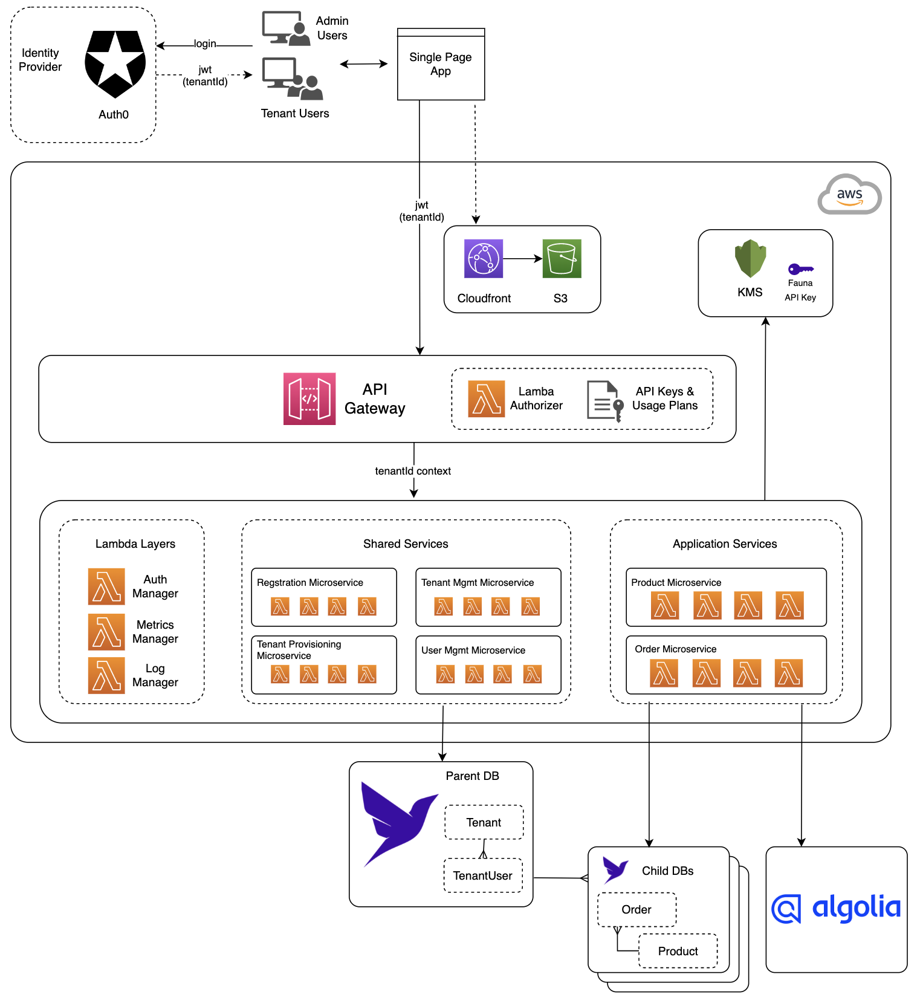

This repository contains unofficial patterns, sample code, or tools to help developers build more effectively with [Fauna][fauna]. All [Fauna Labs][fauna-labs] repositories are provided “as-is” and without support. By using this repository or its contents, you agree that this repository may never be officially supported and moved to the [Fauna organization][fauna-organization].

---

# Serverless SaaS With Fauna and Algolia

This is the project that accompanied [this Algolia LiveCoding session](https://youtu.be/JLtI1URRXG8)

The final working solution can be found in the [/solution](/solution) folder, 
whereas the skeleton of the project (as seen in the LiveCoding session) can be found in [/lab](/lab). 


## Architecture of the final solution



## Prerequisits
If you'd like to try out the solution or follow along the webinar and do the lab, you'll need the following
installed on your workstation/computer:

* Node 16 or greater
* [AWS CLI](https://docs.aws.amazon.com/cli/latest/userguide/getting-started-install.html)
* [Serverless Framework with AWS](https://www.serverless.com/framework/docs/getting-started)
  
  Install `serverless` module via NPM:
  ```
  npm install -g serverless
  ```

You will need:

* An AWS account
* A Fauna account: If you don't yet have a Fauna account, register for one [here](https://dashboard.fauna.com/accounts/register)
* An Algolia account: If you don't have one, sign up for one [here](https://www.algolia.com/users/sign_up)
* An Auth0 account: Sign up for one [here](https://auth0.com/signup)

## Next Step
Navigate to the [/solution](/solution) folder, and follow the [README](/solution/README.md) to set up all the services for the demo solution.