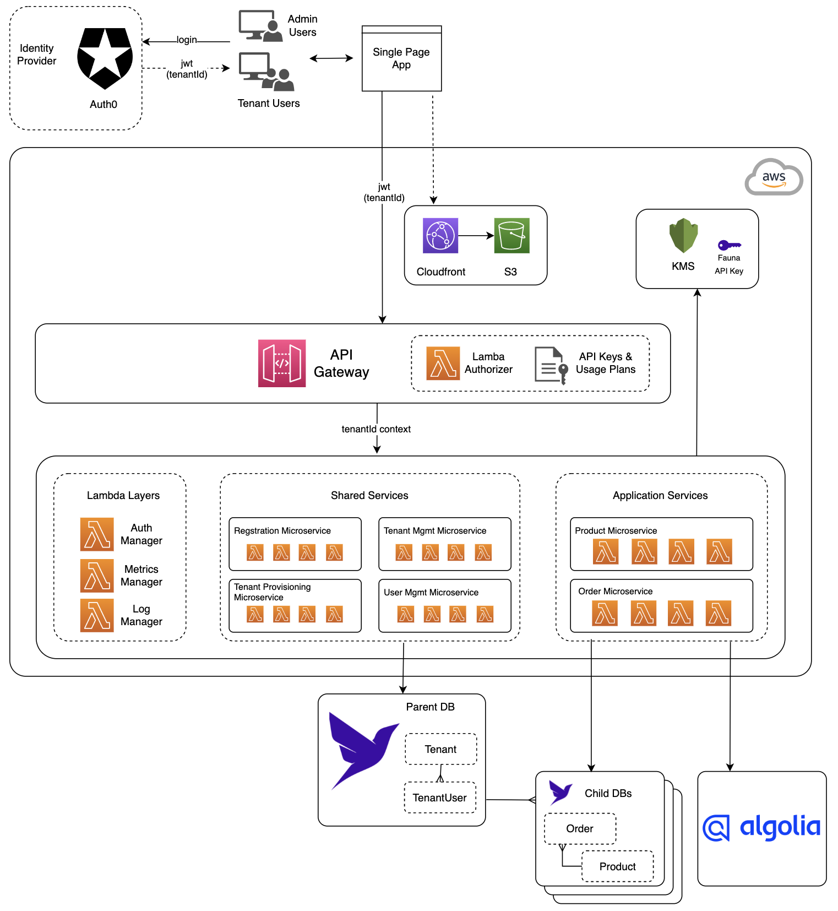
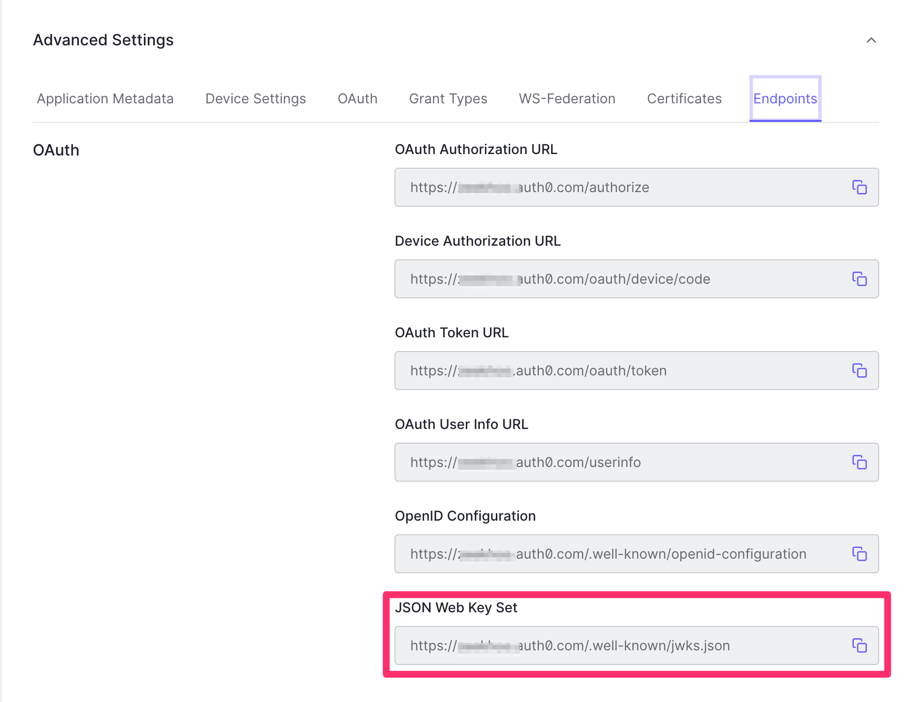
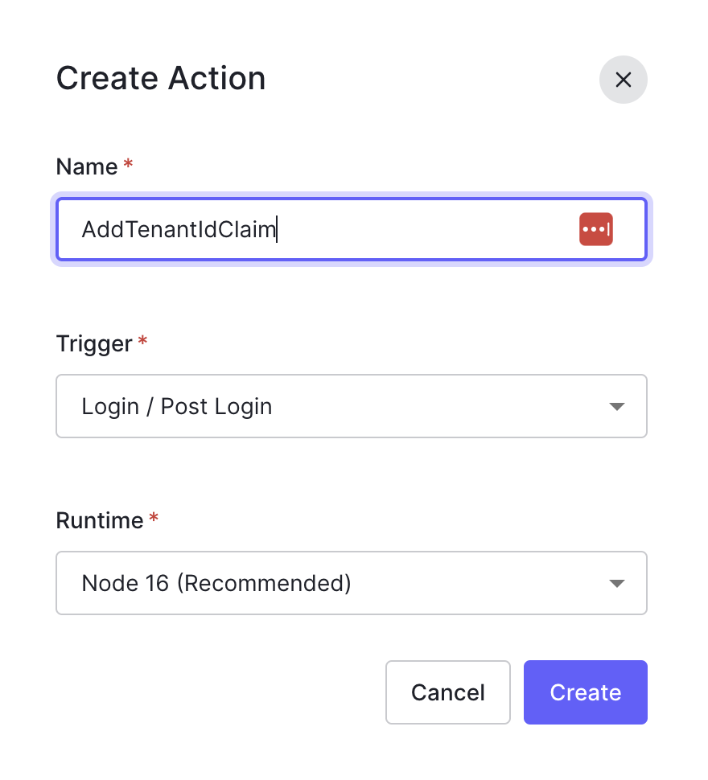
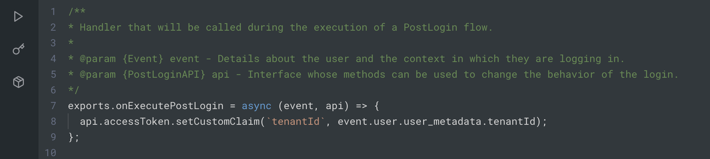
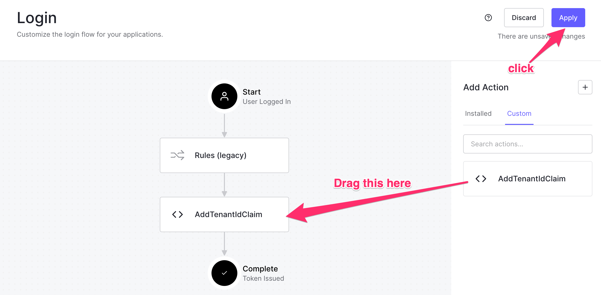
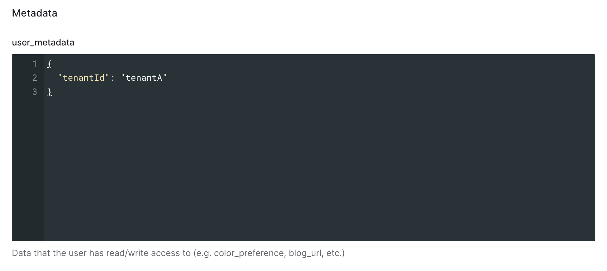

# Serverless SaaS With Fauna and Algolia - Solution page



## Setup

### Fauna Setup
* Login to the Fauna [dashboard](https://beta.dashboard.fauna.com)
* Create a new database
  * Provide a name, e.g. **serverless-workshop**
  * Choose a [Region Group](https://docs.fauna.com/fauna/current/learn/understanding/region_groups),
    e.g. **United States (US)**
  * Click **Create**  
* Generate an API Key
  * In the new database you just created, run the following command in the web shell:
    ```
    Key.create({
      role: 'admin',
      data: {
        name: 'workshop-admin'
      }
    })
    ```
  * Copy the value of your key's **secret** to a temporary location. You may not see it again if you clear the shell
    or start a new session.

### Obtain Algolia Keys
* Login to the dashboard
* Create a new application
* Jot down the **Application ID**, **Search-Only API Key** and **Admin API Key** for the above application

### Auth0 Setup
#### Create an Application
* From the left nav, click Applications > Applications
* Click **+ Create Application**
* Provide a Name for your app
* Select **Single Page Web Applications**
* Click **Create**
* From the Settings tab, configure the following:
  * Allowed Callback URLs = http://localhost:5173
  * Allowed Logout URLs = http://localhost:5173
  * Allowed Web Origins = http://localhost:5173
  * Leave all the other default settings
* Jot down the **Client ID**
* Scroll down to the bottom of the page and expand **Advanced Settings** and navigate to the **Endpoints** tab:
* Jot down the **JSON Web Key Set**
  
  

#### Create an API
* From the left menu panel, click Applications > APIs
* Click **+ Create API**
  * Provide a **Name**
  * Identifier = **https://fauna.demo**
  * Signing Algorithm = **RS256**
  * Leave all the default settings alone

#### Create a Login flow
* From the left menu panel, navigate to Actions > Flows
* Select **Login**
* Add an Action: Using the right panel, click on the **plus sign** to build a custom action:
  *  Name: **AddTenantIdClaim**
  *  Trigger: **Login / Post Login**
  *  Runtime: {use the default}
  *  Click **Create**
  
      

  *  When the screen refreshes, edit the Action with the following code:
      ```
      exports.onExecutePostLogin = async (event, api) => {
        api.accessToken.setCustomClaim(`tenantId`, event.user.user_metadata.tenantId);
      };
      ```
      
  * Click **Deploy**
* Return to the flow page
* Drag the custom action box into the flow
  
    

* Click **Apply**

#### Create a couple logins
* From the left menu panel, nagigate to User Management > Users
* Create a couple users so that you can login later:
  * User "A"
    * Populate the users' **Metadata** with the following value:
      ```
      {
        "tenantId": "tenantA"
      }
      ```
  * User "B"
    * Populate the users' **Metadata** with the following value:
      ```
      {
        "tenantId": "tenantB"
      }
      ```
    

## Next Step
Navigate to the [/solution/api](/solution/api) folder, and follow the [README](/solution/api/README.md) to configure serverless.